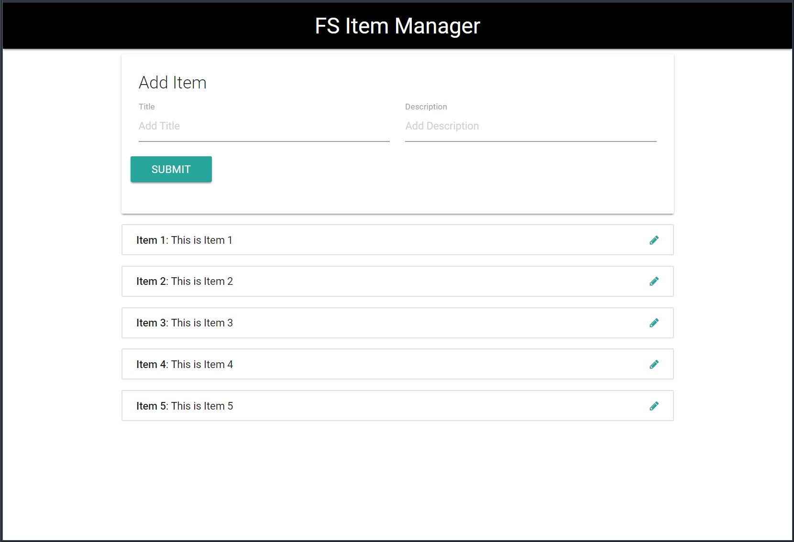

# Angular Firestore
This project is the result of my code-along at the end of the video series [Angular & FireStore Application](https://www.youtube.com/watch?v=gUmItHaVL2w&list=PLillGF-RfqbaISD5mxDCIjsSYk4jbiXi4) by *Brad Traversy*.  His original code repo may be found [here](https://github.com/bradtraversy/angularfs).  My code is similar, but has several minor design changes.  Instructions on how to deploy this code to Firebase are included.

<p align="center">
    <br>
    <a href="https://firestoreapp-a978a.firebaseapp.com/" target="_blank">Firestore Item Manager</a>
</p>

## Versions Used
This project was generated with [Angular CLI](https://github.com/angular/angular-cli) version 1.6.2.
* Angular CLI v1.6.3
* Angular v5.1.2
* Angular Fire 2 v5.0.0-rc.4
* Firebase CLI v3.16.0
* Firebase v4.8.0

## Installing the Project
To begin working with this project, perform the following tasks:

1. Clone this repo: `git clone https://github.com/Stanza987/angular-firestore.git`
1. `cd` into the folder of the cloned repo
1. Run `yarn install` to install dependencies
1. Add your Firebase configuration to `environment.ts` and `environment.prod.ts`

    ```typescript
    export const environment = {
        production: false, //change to true for environment.prod.ts
        firebase: {
            apiKey: '<your-key>',
            authDomain: '<your-project-authdomain>',
            databaseURL: '<your-database-URL>',
            projectId: '<your-project-id>',
            storageBucket: '<your-storage-bucket>',
            messagingSenderId: '<your-messaging-sender-id>'
        }
    };
    ```
1. Uncomment Firestore API endpoints in `item.service.ts` to enable CRUD functionality.

## Development server
Run `ng serve` for a dev server. Navigate to `http://localhost:4200/`. The app will automatically reload if you change any of the source files.

## Production Build
Run `ng build --prod` to build the project. The static assets will be stored in the `dist/` directory.

## Deploying to Firebase
1. Run `ng build --prod`
1. Run `firebase init` and choose `Hosting`, follow the on-screen prompts.
1. Delete the `public` directory automatically generated by the Firebase CLI
1. Change `firebase.json` to
    ```
    {
        "hosting": {
            "public": "dist",
            "ignore": [
                "firebase.json",
                "**/.*",
                "**/node_modules/**"
            ],
            "rewrites": [
                {
                    "source": "**",
                    "destination": "/index.html"
                }
            ]
        }
    }
    ```
1. Run `firebase deploy`

## Further help
* [Angular CLI README](https://github.com/angular/angular-cli/blob/master/README.md)
* [Angular Fire 2 README](https://github.com/angular/angularfire2/blob/master/README.md)
* [Firebase Docs](https://firebase.google.com/docs/web/setup)
